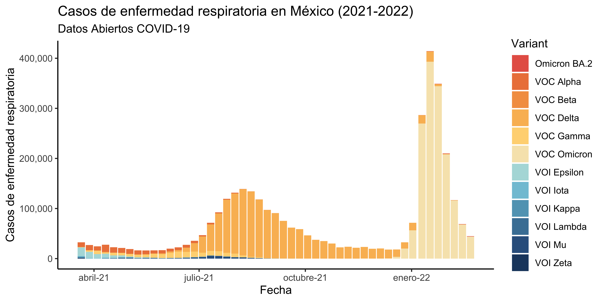

# VariantesCOVID

> **Nota** A partir del 5 de marzo estas gráficas se actualizan diario automáticamente. 


Gráficas que ilustran la proporción de casos de COVID-19 por variante en México. 

## Datos

Los datos necesitas obtenerlos de [GISAID](https://www.gisaid.org/) yendo a `Downloads > Variant Surveillance`. 

Alternativamente puedes usar el scrapper `download_gisaid.py` con tu password y tu usuario. No es un producto oficial y úsalo bajo tu riesgo pues desconozco si va en contra de los términos y condiciones de GISAID.



## Automatización

Para Linux puedes usar `crontab` para automatizar la descarga de la base de datos. Por ahora necesitas `mariadb` para que `R` los transforme. Sugerencia: 

1. Crea tu crontab parecido a este:

```{bash} 
57 14 * * * export DISPLAY=:0 && /bin/sh /home/rodrigo/VariantesCovid/orchestrate.sh > /dev/null 2>&1
```

donde tu número de display se obtiene haciendo

```{bash}
env | grep 'DISPLAY'
```

2. Guarda tus credenciales en `gisaid_user_password.txt` donde el primer renglón es tu usuario y el segundo tu password:

```{bash}
usuario
password
```

3. Crea tu base en `mariadb` que se llame `COVID` y dale el acceso a tu usuario. Para poner tu usuario exporta las variables en tu `.bash_profile` 

```{bash}
export MariaDB_user="usuario"
export MariaDB_password="password"
```

4. Cambia los paths en el `orchestrate.sh` y vulélvelo ejecutable con `chmod +x orchestrate.sh`.

## Referencias de GISAID

Khare, S., et al (2021) _GISAID’s Role in Pandemic Response._ China CDC Weekly, 3(49): 1049-1051. [doi:10.46234/ccdcw2021.255](doi:10.46234/ccdcw2021.255)  PMCID: 8668406

Elbe, S. and Buckland-Merrett, G. (2017) _Data, disease and diplomacy: GISAID’s innovative contribution to global health._ Global Challenges, 1:33-46. [doi:10.1002/gch2.1018](doi:10.1002/gch2.1018)  PMCID: 31565258

Shu, Y. and McCauley, J. (2017)  _GISAID: from vision to reality._ EuroSurveillance, 22(13) [doi:10.2807/1560-7917.ES.2017.22.13.30494](doi:10.2807/1560-7917.ES.2017.22.13.30494)  PMCID: PMC5388101