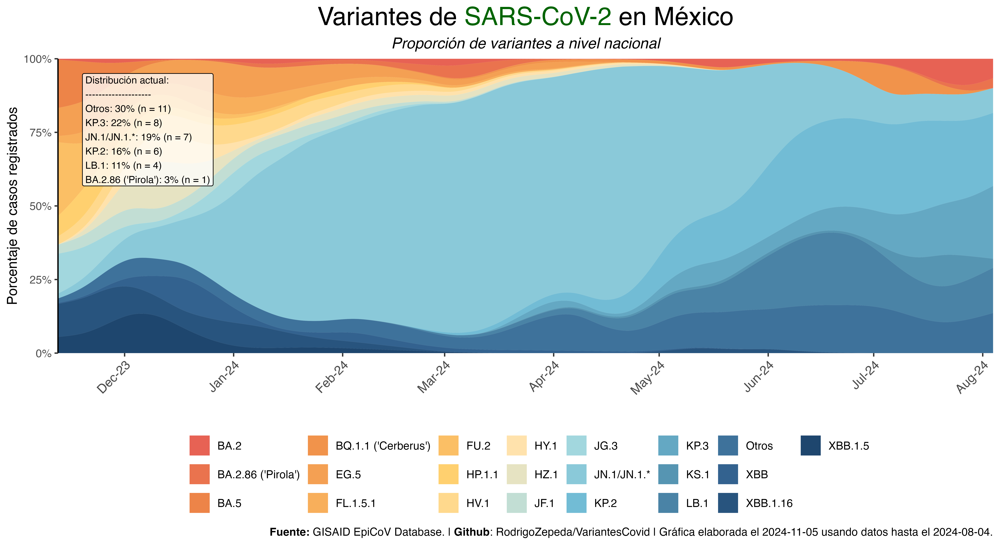
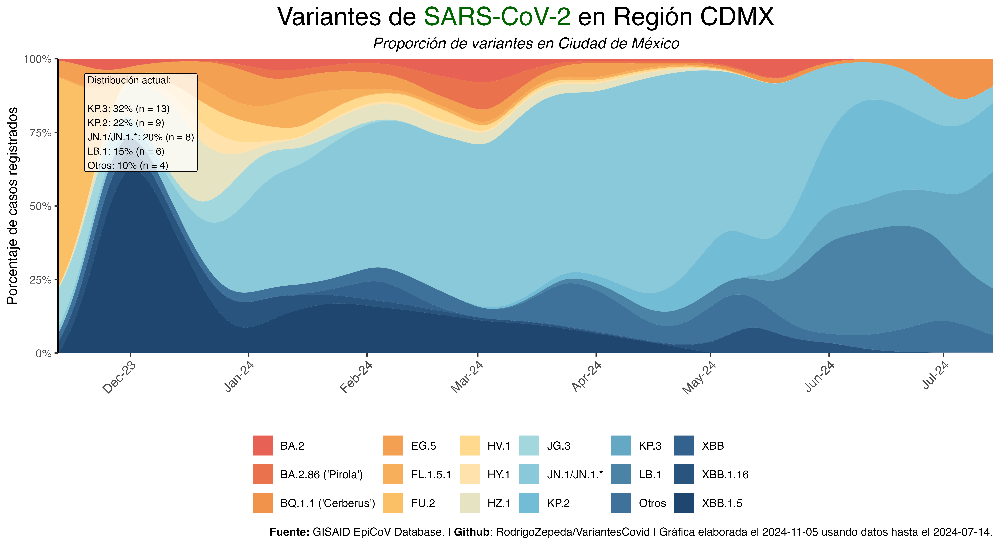
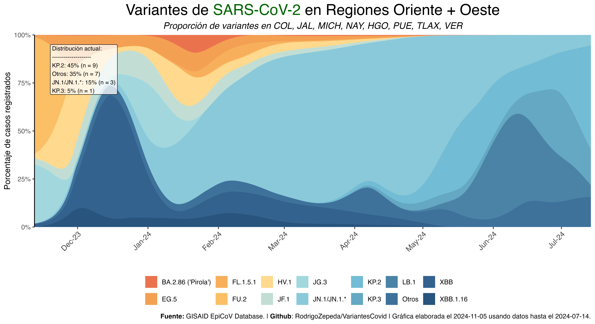
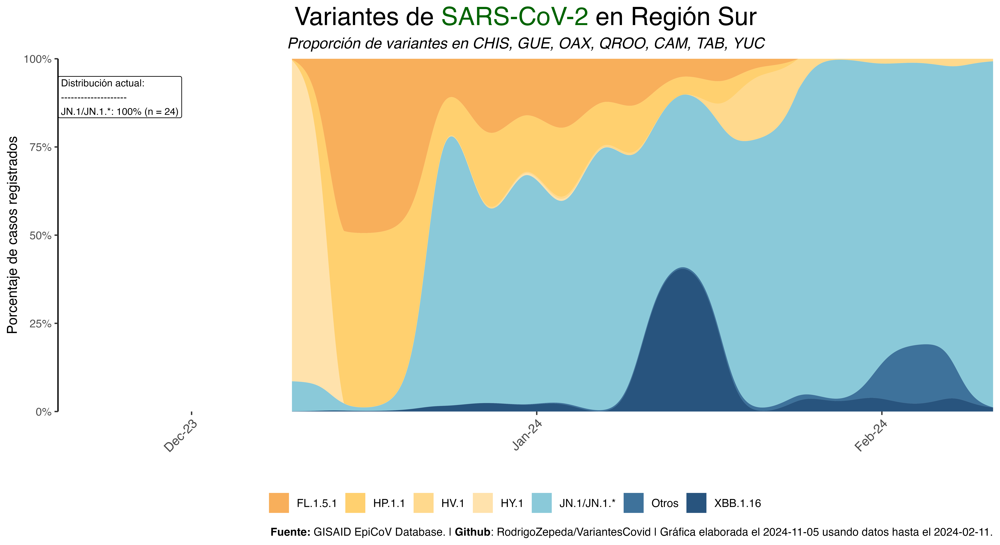

# VariantesCOVID

### Nacional



### CDMX



### Norte


### Oriente y Oeste



### Sur 



## Descripción 
Publicación diaria (automatizada) de las variantes en México usando datos de [GISAID](https://www.gisaid.org/).
+ Tablas en la carpeta `tablas`
+ Gráficas en la carpeta `images`

> **Nota** Si usas los datos debes citar a GISAID (ver referencias)

## Paquete covidmx en rstats

Para analizar en `R` los datos más actuales de esta publicación instala el paquete [`covidmx`](https://github.com/RodrigoZepeda/covidmx):

```{r}
library(covidmx)
variantes <- descarga_datos_variantes_GISAID()
```

> **Nota** Si usas los datos del paquete debes citar a GISAID (ver referencias) así como el paquete [`covidmx`](https://github.com/RodrigoZepeda/covidmx). 
 

## Datos

Los datos necesitas obtenerlos de [GISAID](https://www.gisaid.org/) yendo a `Downloads > Variant Surveillance`. 

Alternativamente puedes usar el scrapper `download_gisaid.py` con tu password y tu usuario. No es un producto oficial y úsalo bajo tu riesgo pues desconozco si va en contra de los términos y condiciones de GISAID.

## Automatización

Para Linux puedes usar `crontab` para automatizar la descarga de la base de datos. Sugerencia: 

1. Crea tu crontab parecido a este:

```{bash} 
57 14 * * * export DISPLAY=:0 && /bin/sh /home/rodrigo/VariantesCovid/orchestrate.sh > /dev/null 2>&1
```

donde tu número de display se obtiene haciendo

```{bash}
env | grep 'DISPLAY'
```

2. Guarda tus credenciales en `gisaid_user_password.txt` donde el primer renglón es tu usuario y el segundo tu password:

```{bash}
usuario
password
```

3. Cambia los paths en el `orchestrate.sh` y vulélvelo ejecutable con `chmod +x orchestrate.sh`.

## Funcionamiento

Algunas de las variantes que no fueron asignadas a un linaje uso `pangolin` para asignarlas. Para ello el ciclo se vuelve más complejo pues hay que descargar los `FASTA` de GISAID. El diagrama es así 


## Referencias de GISAID

Khare, S., et al (2021) _GISAID’s Role in Pandemic Response._ China CDC Weekly, 3(49): 1049-1051. [doi:10.46234/ccdcw2021.255](doi:10.46234/ccdcw2021.255)  PMCID: 8668406

Elbe, S. and Buckland-Merrett, G. (2017) _Data, disease and diplomacy: GISAID’s innovative contribution to global health._ Global Challenges, 1:33-46. [doi:10.1002/gch2.1018](doi:10.1002/gch2.1018)  PMCID: 31565258

Shu, Y. and McCauley, J. (2017)  _GISAID: from vision to reality._ EuroSurveillance, 22(13) [doi:10.2807/1560-7917.ES.2017.22.13.30494](doi:10.2807/1560-7917.ES.2017.22.13.30494)  PMCID: PMC5388101
